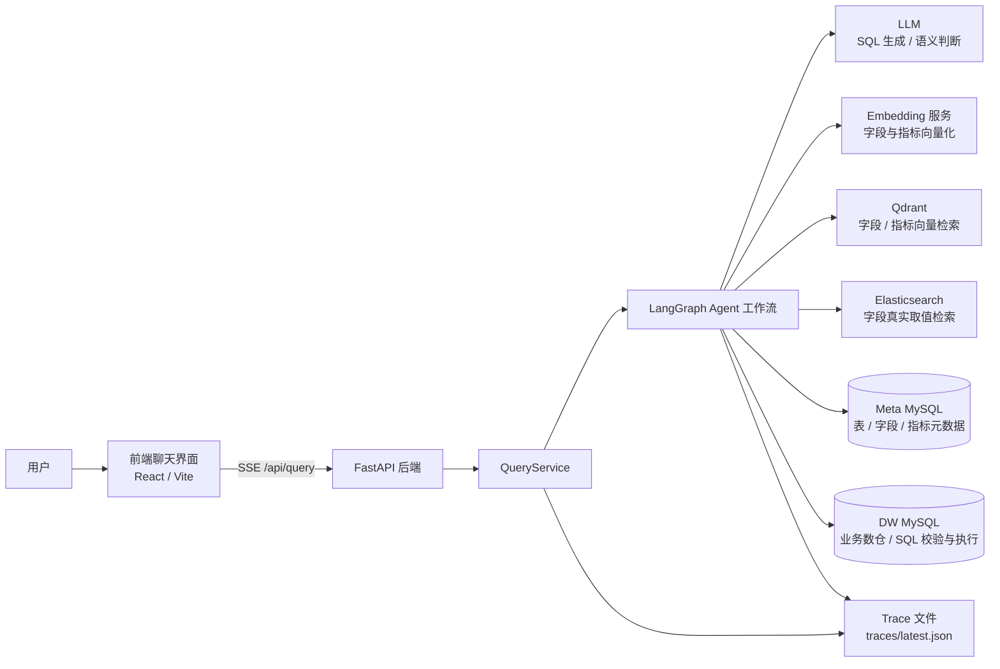
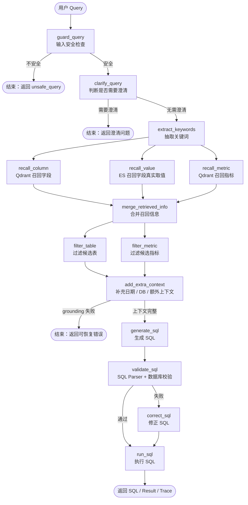

# Shopkeeper Agent Backend

电商问数 Agent 后端项目，面向电商经营分析场景，把用户的自然语言问题转换为可执行 SQL，并通过 FastAPI + LangGraph 编排完成元数据召回、字段值 grounding、SQL 生成、SQL 校验、SQL 执行和 Trace 记录。

## 1. 项目背景：为什么做电商问数 Agent

电商业务每天都会产生大量订单、商品、用户、地区、时间等维度数据。运营、商品、销售和管理人员经常需要回答类似问题：

- 华北地区的总销售额是多少？
- 2025 年第一季度各大区 GMV 排名如何？
- 美的品牌在某个时间段的订单数是多少？
- 按会员等级统计订单数和销售额表现如何？

传统 BI 或报表系统通常要求使用者提前知道报表入口、指标口径、字段含义和筛选条件；如果临时问题没有现成报表，就需要数据同学手写 SQL。这个流程存在几个痛点：

1. **问数门槛高**：业务人员需要理解表结构、字段名、指标口径和 SQL 写法。
2. **响应链路长**：临时分析依赖数据同学排期，难以支持高频探索式分析。
3. **口径容易漂移**：同一个“销售额”“GMV”“订单数”可能被不同人写成不同 SQL。
4. **LLM 直接写 SQL 不稳定**：大模型容易编造字段、编造字段值、生成危险 SQL 或遗漏过滤条件。
5. **问题排查困难**：自然语言到 SQL 的中间过程如果不可观测，很难定位是召回错、上下文错、SQL 生成错还是执行错。

因此，本项目尝试构建一个面向电商数据仓库的问数 Agent：让用户用自然语言提问，系统自动完成元数据检索、指标识别、字段值校验、SQL 生成和执行，同时通过 Trace 与 eval 测试集控制可观测性和回归质量。

## 2. 系统架构图



核心组件说明：

| 组件 | 作用 |
|---|---|
| 前端 | 提供聊天式问数入口，接收后端 SSE 流式进度与最终结果。 |
| FastAPI | 对外暴露 `/api/query` 接口，管理应用生命周期和外部客户端连接。 |
| QueryService | 创建请求级 state/context，调用 LangGraph，并把执行过程包装为 SSE。 |
| LangGraph | 编排 Agent 节点链路，控制 guardrail、召回、过滤、SQL 生成、校验和执行。 |
| MySQL Meta | 存储表、字段、指标、字段依赖、主外键等元数据。 |
| MySQL DW | 存储业务数据，并承担最终 SQL 校验与执行。 |
| Qdrant | 基于向量召回字段和指标。 |
| Elasticsearch | 对字段真实取值做 exact-first / fuzzy 检索。 |
| LLM | 负责关键词扩展、候选过滤、SQL 生成、SQL 修正等语义任务。 |
| Trace | 记录每个节点的输入摘要、输出摘要、耗时和错误信息，便于排查。 |

## 3. Agent 工作流图：从用户 query 到 SQL 执行



工作流特点：

- **先拦截再生成**：不安全请求、敏感信息请求、破坏性 SQL 请求会在 `guard_query` 阶段结束。
- **先澄清再执行**：指标、时间范围或分析目标过于模糊时，会返回澄清问题，不盲目生成 SQL。
- **三路召回并行**：字段、字段值、指标分别召回，再统一合并为 SQL 生成上下文。
- **SQL 执行前强校验**：LLM 输出先经过 SQL Parser 清洗和安全检查，再交给 DW MySQL 校验。
- **全链路 Trace**：每个节点都会记录输入摘要、输出摘要、错误类型、耗时和建议动作。

## 4. 核心问题与解决方案

### 4.1 SQL 不稳定 → SQL Parser

LLM 可能返回 Markdown 代码块、多条 SQL、解释性文本、危险 SQL 或 MySQL optimizer 输出。如果直接执行，容易导致语法错误或安全风险。

项目通过 `app/utils/sql_parser.py` 中的 SQL Parser 做前置清洗与约束：

- 移除 Markdown SQL code fence。
- 从模型输出中提取第一段 `SELECT` / `WITH` 查询。
- 截断多语句，只保留第一条语句。
- 移除 SQL 注释。
- 拒绝 `INSERT`、`UPDATE`、`DELETE`、`DROP`、`ALTER`、`TRUNCATE` 等危险关键字。
- 禁止多语句分号。
- 只允许只读查询进入后续校验与执行。

SQL 生成后会先进入 `validate_sql` 节点：Parser 清洗通过后，再调用 DW MySQL 做真实语法校验；失败时进入 `correct_sql` 尝试修正。

### 4.2 字段值幻觉 → exact-first grounding

自然语言问题中经常包含真实业务取值，例如“华北地区”“美的品牌”“食品饮料品类”。LLM 如果只根据语义猜测，可能生成不存在的字段值或错误过滤条件。

项目在 `recall_value` 节点中引入 exact-first grounding：

1. 从用户 query、关键词和扩展关键词中构造字段值候选。
2. 优先调用 Elasticsearch 的 exact search 检索真实字段值。
3. exact 未命中时才退回 fuzzy search。
4. 如果 query 明确包含地区、品牌、品类等过滤域，会对模糊结果做域过滤。
5. 对用户明确指定的取值逐个校验：
   - 全部未命中：返回 `value_grounding_failed`，不生成 SQL。
   - 部分命中：返回 `partial_value_grounding_failed` warning，并保留已命中的值。

这个策略避免了“火星地区”这类不存在取值被 LLM 编进 SQL，也能在“对比华北和火星地区”这种部分可用问题中给出明确 warning。

### 4.3 召回噪声 → 上下文过滤

字段、指标、字段值召回会带来候选噪声。如果把所有召回结果直接塞给 LLM，容易造成：

- 选错表或错 join。
- 把无关字段当成过滤条件。
- 把相似但不同的指标混用。
- 上下文过长，影响 SQL 生成稳定性。

项目通过多层上下文过滤降低噪声：

1. `merge_retrieved_info` 合并三路召回结果，并根据指标依赖字段补齐必要字段。
2. 根据字段取值补齐所属字段，把真实取值写入字段 examples。
3. 补齐候选表的主键和外键，避免 SQL 生成阶段缺失 join 条件。
4. `filter_table` 对候选表做二次筛选。
5. `filter_metric` 对候选指标做二次筛选。
6. `add_extra_context` 补充日期、数据库版本等 SQL 生成必要上下文。

最终进入 `generate_sql` 的不是原始召回列表，而是经过合并、去重、补齐、过滤后的结构化上下文。

### 4.4 黑盒难排查 → Trace

自然语言问数链路涉及多个外部系统和多个 LLM 节点。如果只看最终 SQL，很难判断失败发生在哪里。

项目在 LangGraph 节点外包了一层 `trace_node`，每个节点都会记录：

- 节点名称。
- 开始时间、结束时间和耗时。
- 输入 state 摘要。
- 输出摘要。
- 错误类型、错误节点、是否可恢复、建议动作。

Trace 会保存到：

```text
traces/YYYY-MM-DD/<request_id>.json
traces/latest.json
```

API 最终响应中也会返回 `trace_path`，便于从一次线上请求直接定位到完整执行轨迹。

### 4.5 回归不可控 → eval 测试集

Agent 调整 Prompt、召回策略、SQL 校验或字段值 grounding 后，容易修好一个 case 又破坏另一个 case。

项目提供了轻量级 eval 框架：

- 测试集：`eval/cases.yaml`
- 执行入口：`eval/run_eval.py`
- 最新报告：`eval/reports/latest.md` 和 `eval/reports/latest.json`

当前测试集覆盖：

- 普通问数：地区、品牌、品类、时间、分组、排序、多指标。
- 安全拦截：DROP TABLE、prompt injection、系统提示词泄露、敏感信息查询。
- 澄清问题：指标不清、时间范围不清、宽泛分析请求。
- 字段值 grounding：不存在字段值、部分字段值不存在 warning。

评估逻辑会检查是否生成 SQL、是否命中必须 SQL 片段、是否出现禁用 SQL 片段、是否按预期拦截、是否按预期澄清，以及 Trace 中是否出现关键节点。

## 5. 快速启动命令

### 5.1 环境准备

项目依赖 Python 3.9+，建议使用 `uv` 管理依赖。

```bash
uv sync
```

配置 LLM API Key：

```bash
# Windows Git Bash 示例
export LLM_API_KEY="你的 LLM API Key"
```

确认以下外部服务可用，并与 `conf/app_config.yaml` 中配置保持一致：

- Meta MySQL
- DW MySQL
- Qdrant
- Elasticsearch
- Embedding 服务
- LLM 服务

### 5.2 启动后端

在项目根目录执行：

```bash
uv run fastapi dev main.py
```

后端接口：

```text
POST /api/query
Content-Type: application/json
Accept: text/event-stream
```

请求示例：

```bash
curl -N -X POST "http://127.0.0.1:8000/api/query" \
  -H "Content-Type: application/json" \
  -d '{"query":"华北地区的总销售额"}'
```

### 5.3 启动前端

```bash
cd frontend
pnpm install
pnpm dev
```

前端项目基于 React + Vite，提供聊天式问数界面和 SSE 流程展示。

### 5.4 构建元数据知识库

如需重建元数据知识库，可使用项目脚本入口：

```bash
uv run python -m app.scripts.build_meta_knowledge
```

该脚本依赖 Meta MySQL、Qdrant、Elasticsearch、Embedding 等配置，请先确认外部服务已启动并完成必要的数据准备。

## 6. 示例问题与返回结果截图

> 这里先保留占位，后续请粘贴前端截图、接口返回截图或 SQL 执行结果截图。

### 示例 1：地区销售额

问题：

```text
华北地区的总销售额
```

运行截图：


### 示例 2：多维度组合过滤

问题：

```text
统计华北地区美的品牌的销售额
```

运行截图：


### 示例 3：排序与分组

问题：

```text
统计 2025 年第一季度各大区的 GMV，并按 GMV 从高到低排序
```

运行截图：


### 示例 4：字段值 grounding 失败

问题：

```text
统计火星地区的销售额
```

运行截图：

 ```

## 7. 自动化测试 / eval 结果


### 单元测试

SQL Parser 单元测试入口：

```bash
uv run pytest tests/test_sql_parser.py
```


### Agent Eval

运行完整问数 Agent 回归评估：

```bash
uv run python -m eval.run_eval
```

最近一次本地报告可参考：

```text
eval/reports/latest.md
eval/reports/latest.json
```


## 8. 已知不足与后续优化

当前项目已经具备从自然语言 query 到 SQL 执行的完整链路，但仍有一些待优化点：

1. **复杂时间表达仍需增强**
   - 例如“最近三个月”“上周同期”“环比”“同比”等时间语义，需要更稳定的日期解析和边界生成。

2. **指标口径治理可以更严格**
   - 当前通过指标元数据和召回过滤降低口径漂移，后续可引入更结构化的指标 DSL 或 metric registry。

3. **SQL 语义正确性仍依赖 eval 覆盖**
   - Parser 能保证只读和基础语法安全，但无法完全证明业务语义正确。后续应增加结果列、行数、数值范围和黄金 SQL 对比。

4. **召回质量需要持续评估**
   - 可以在 eval 中增加字段召回命中率、指标召回命中率、字段值召回命中率等中间指标。

5. **多轮对话能力有限**
   - 当前更偏单轮问数。后续可支持基于上一轮 SQL、结果和上下文继续追问。

6. **权限与数据安全需要产品化治理**
   - 目前已有输入侧 guardrail 和 SQL Parser，但真实生产环境还需要用户级权限、字段级脱敏、行级权限和审计日志。

7. **Trace 展示仍偏工程侧**
   - 当前 Trace 主要落 JSON 文件，后续可以提供可视化 Trace 页面，方便非开发人员查看每一步召回和生成过程。

8. **外部服务部署仍需标准化**
   - MySQL、Qdrant、Elasticsearch、Embedding、LLM 目前依赖本地配置，后续可补充 Docker Compose 或部署文档。

## 9. 相关文件

| 文件 | 说明 |
|---|---|
| `main.py` | FastAPI 应用入口。 |
| `app/api/routers/query_router.py` | `/api/query` SSE 接口。 |
| `app/services/query_service.py` | 查询服务，负责调用 LangGraph 并返回最终响应。 |
| `app/agent/graph.py` | LangGraph 工作流编排。 |
| `app/agent/nodes/` | Agent 各节点实现。 |
| `app/utils/sql_parser.py` | SQL 清洗、安全检查与提取。 |
| `app/observability/trace_manager.py` | 结构化 Trace 管理。 |
| `eval/cases.yaml` | 自动化评估测试集。 |
| `eval/run_eval.py` | eval 执行入口。 |
| `eval/reports/latest.md` | 最新 Markdown 评估报告。 |
| `conf/app_config.yaml` | 应用配置模板。 |
| `frontend/` | React + Vite 前端项目。 |
