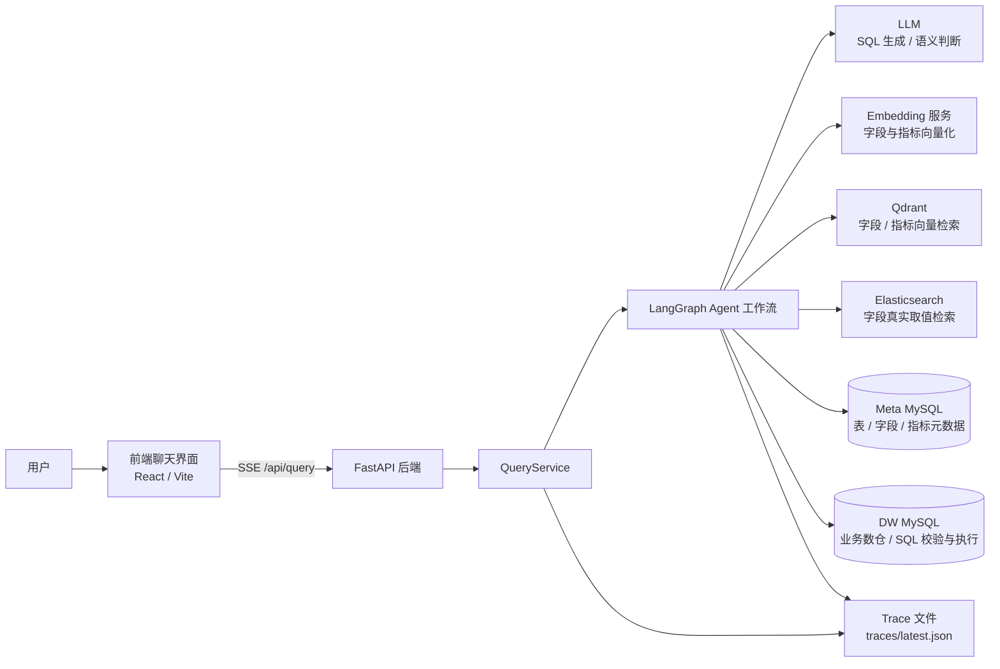
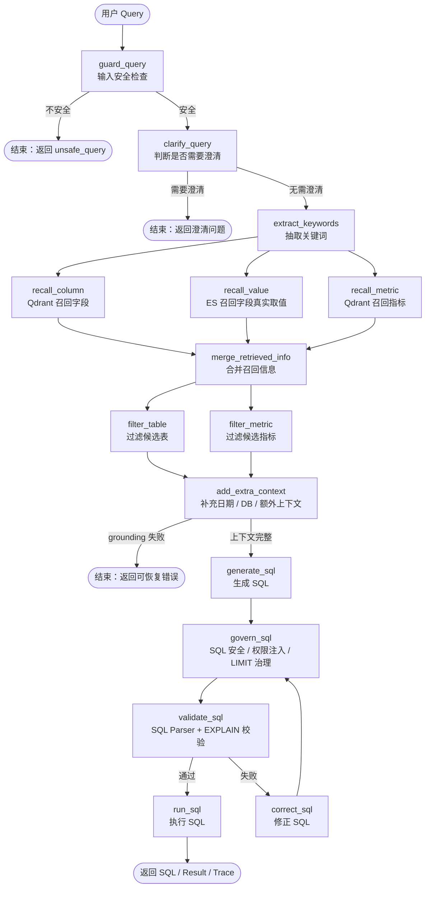
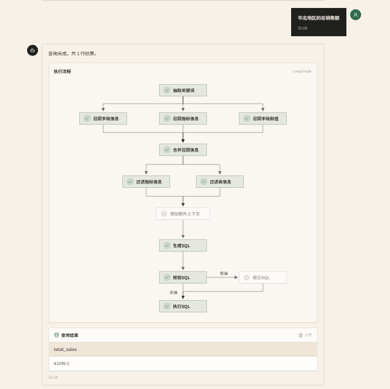
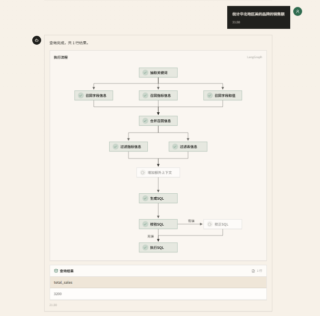
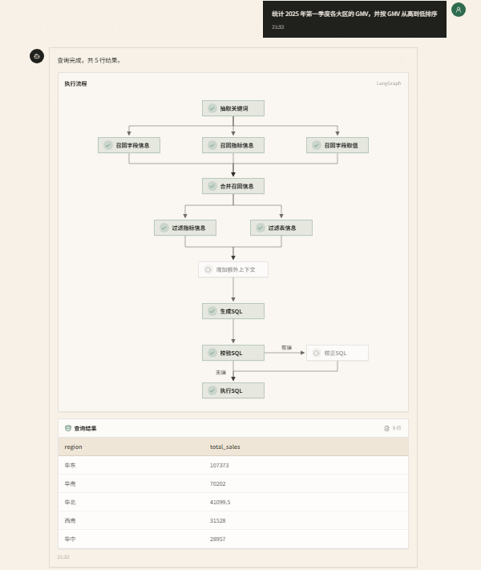
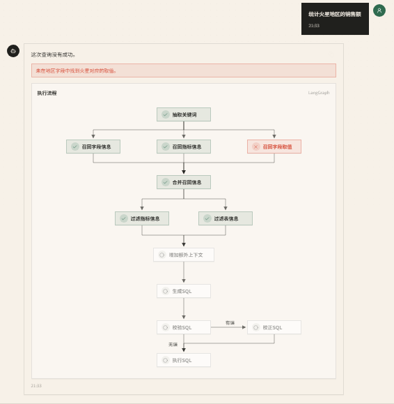

# Shopkeeper Agent Backend

电商问数 Agent 后端项目，面向电商经营分析场景，把用户的自然语言问题转换为可执行 SQL，并通过 FastAPI + LangGraph 编排完成元数据召回、字段值 grounding、SQL 生成、SQL 校验、SQL 执行和 Trace 记录。

## 1. 项目背景：为什么做电商问数 Agent

电商业务每天都会产生大量订单、商品、用户、地区、时间等维度数据。运营、商品、销售和管理人员经常需要回答类似问题：

- 华北地区的总销售额是多少？
- 2025 年第一季度各大区 GMV 排名如何？
- 美的品牌在某个时间段的订单数是多少？
- 按会员等级统计订单数和销售额表现如何？

传统 BI 或报表系统通常要求使用者提前知道报表入口、指标口径、字段含义和筛选条件；如果临时问题没有现成报表，就需要数据同学手写 SQL。这个流程存在几个痛点：

1. **问数门槛高**：业务人员需要理解表结构、字段名、指标口径和 SQL 写法。
2. **响应链路长**：临时分析依赖数据同学排期，难以支持高频探索式分析。
3. **口径容易漂移**：同一个“销售额”“GMV”“订单数”可能被不同人写成不同 SQL。
4. **LLM 直接写 SQL 不稳定**：大模型容易编造字段、编造字段值、生成危险 SQL 或遗漏过滤条件。
5. **问题排查困难**：自然语言到 SQL 的中间过程如果不可观测，很难定位是召回错、上下文错、SQL 生成错还是执行错。

因此，本项目尝试构建一个面向电商数据仓库的问数 Agent：让用户用自然语言提问，系统自动完成元数据检索、指标识别、字段值校验、SQL 生成和执行，同时通过 Trace 与 eval 测试集控制可观测性和回归质量。

## 2. 系统架构图



核心组件说明：

| 组件 | 作用 |
|---|---|
| 前端 | 提供聊天式问数入口，接收后端 SSE 流式进度与最终结果。 |
| FastAPI | 对外暴露 `/api/query` 接口，管理应用生命周期和外部客户端连接。 |
| QueryService | 创建请求级 state/context，调用 LangGraph，并把执行过程包装为 SSE。 |
| LangGraph | 编排 Agent 节点链路，控制 guardrail、召回、过滤、SQL 生成、校验和执行。 |
| MySQL Meta | 存储表、字段、指标、字段依赖、主外键等元数据。 |
| MySQL DW | 存储业务数据，并承担最终 SQL 校验与执行。 |
| Qdrant | 基于向量召回字段和指标。 |
| Elasticsearch | 对字段真实取值做 exact-first / fuzzy 检索。 |
| LLM | 负责关键词扩展、候选过滤、SQL 生成、SQL 修正等语义任务。 |
| Trace | 记录每个节点的输入摘要、输出摘要、耗时和错误信息，便于排查。 |

## 3. Agent 工作流图：从用户 query 到 SQL 执行



工作流特点：

- **先拦截再生成**：不安全请求、敏感信息请求、破坏性 SQL 请求会在 `guard_query` 阶段结束。
- **先澄清再执行**：指标、时间范围或分析目标过于模糊时，会返回澄清问题，不盲目生成 SQL。
- **三路召回并行**：字段、字段值、指标分别召回，再统一合并为 SQL 生成上下文。
- **SQL 执行前强治理**：LLM 输出先经过 `govern_sql` 做只读安全、敏感字段拦截、权限注入和 LIMIT 兜底，再由 `validate_sql` 完成 Parser 清洗、DW MySQL EXPLAIN 校验和风险分析。
- **全链路 Trace**：每个节点都会记录输入摘要、输出摘要、错误类型、耗时和建议动作。

## 4. 核心问题与解决方案

### 4.1 SQL 不稳定 → SQL Parser

LLM 可能返回 Markdown 代码块、多条 SQL、解释性文本、危险 SQL 或 MySQL optimizer 输出。如果直接执行，容易导致语法错误或安全风险。

项目通过 `app/utils/sql_parser.py` 中的 SQL Parser 做前置清洗与约束：

- 移除 Markdown SQL code fence。
- 从模型输出中提取第一段 `SELECT` / `WITH` 查询。
- 截断多语句，只保留第一条语句。
- 移除 SQL 注释。
- 拒绝 `INSERT`、`UPDATE`、`DELETE`、`DROP`、`ALTER`、`TRUNCATE` 等危险关键字。
- 禁止多语句分号。
- 只允许只读查询进入后续校验与执行。

SQL 生成后会先进入 `govern_sql` 节点做执行前治理，再进入 `validate_sql` 节点：Parser 清洗通过后，调用 DW MySQL 做真实语法校验和 EXPLAIN 风险分析；失败时进入 `correct_sql` 尝试修正，修正后的 SQL 会重新回到 `govern_sql`。

### 4.2 字段值幻觉 → exact-first grounding

自然语言问题中经常包含真实业务取值，例如“华北地区”“美的品牌”“食品饮料品类”。LLM 如果只根据语义猜测，可能生成不存在的字段值或错误过滤条件。

项目在 `recall_value` 节点中引入 exact-first grounding：

1. 从用户 query、关键词和扩展关键词中构造字段值候选。
2. 优先调用 Elasticsearch 的 exact search 检索真实字段值。
3. exact 未命中时才退回 fuzzy search。
4. 如果 query 明确包含地区、品牌、品类等过滤域，会对模糊结果做域过滤。
5. 对用户明确指定的取值逐个校验：
   - 全部未命中：返回 `value_grounding_failed`，不生成 SQL。
   - 部分命中：返回 `partial_value_grounding_failed` warning，并保留已命中的值。

这个策略避免了“火星地区”这类不存在取值被 LLM 编进 SQL，也能在“对比华北和火星地区”这种部分可用问题中给出明确 warning。

### 4.3 召回噪声 → 上下文过滤

字段、指标、字段值召回会带来候选噪声。如果把所有召回结果直接塞给 LLM，容易造成：

- 选错表或错 join。
- 把无关字段当成过滤条件。
- 把相似但不同的指标混用。
- 上下文过长，影响 SQL 生成稳定性。

项目通过多层上下文过滤降低噪声：

1. `merge_retrieved_info` 合并三路召回结果，并根据指标依赖字段补齐必要字段。
2. 根据字段取值补齐所属字段，把真实取值写入字段 examples。
3. 补齐候选表的主键和外键，避免 SQL 生成阶段缺失 join 条件。
4. `filter_table` 对候选表做二次筛选。
5. `filter_metric` 对候选指标做二次筛选。
6. `add_extra_context` 补充日期、数据库版本等 SQL 生成必要上下文。

最终进入 `generate_sql` 的不是原始召回列表，而是经过合并、去重、补齐、过滤后的结构化上下文。

### 4.4 黑盒难排查 → Trace

自然语言问数链路涉及多个外部系统和多个 LLM 节点。如果只看最终 SQL，很难判断失败发生在哪里。

项目在 LangGraph 节点外包了一层 `trace_node`，每个节点都会记录：

- 节点名称。
- 开始时间、结束时间和耗时。
- 输入 state 摘要。
- 输出摘要。
- 错误类型、错误节点、是否可恢复、建议动作。

Trace 会保存到：

```text
traces/YYYY-MM-DD/<request_id>.json
traces/latest.json
```

API 最终响应中也会返回 `trace_path`，便于从一次线上请求直接定位到完整执行轨迹。

### 4.5 回归不可控 → eval 测试集

Agent 调整 Prompt、召回策略、SQL 校验或字段值 grounding 后，容易修好一个 case 又破坏另一个 case。

项目提供结果等价 eval 框架：

- 开发集：`eval/cases_dev.yaml`，30 个意图、90 条表达。
- 隔离测试集：`eval/cases_test.yaml`，10 个意图、30 条表达。
- 执行入口：`eval/run_eval.py` 与 `eval/run_benchmarks.py`。
- 运行产物：`eval/reports/<run_id>/` 与 `traces/eval/<run_id>/`。

当前测试集覆盖：

- 普通问数：地区、品牌、品类、时间、分组、排序、多指标。
- 安全拦截：DROP TABLE、prompt injection、系统提示词泄露、敏感信息查询。
- 澄清问题：指标不清、时间范围不清、宽泛分析请求。
- 字段值 grounding：不存在字段值、部分字段值不存在 warning。

普通问数会在同一 DW 会话中执行 Agent SQL 与 Gold SQL，并比较结果等价性；安全拦截、Grounding 和澄清按确定性分支断言。报告额外记录 Execution Accuracy、意图宏平均、分类指标和 P50/P90/P95。

### 4.6 SQL 执行前治理与权限隔离

为了让项目不只停留在“本地能跑通”的 NL2SQL 原型，SQL 生成后新增了 `govern_sql` 节点，位于 `generate_sql` / `correct_sql` 之后、`validate_sql` 之前：

- `app/agent/nodes/govern_sql.py` 负责统一执行 SQL 治理策略。
- `app/security/sql_policy.py` 负责只读查询检查、危险关键字拦截、敏感字段拦截和默认 `LIMIT 500` 兜底。
- `app/security/permission_policy.py` 负责根据请求级 `PermissionContext` 注入行级权限条件。
- 默认角色为 `admin`，兼容原有前端和 eval 请求，不会破坏既有调用链路。
- 非管理员可以通过 `allowed_region_ids` 或 `allowed_region_names` 限制可查询地区，系统会把权限条件注入到 SQL 中，而不是依赖前端自觉传过滤条件。

这部分的重点不是实现完整企业 IAM，而是在项目里体现数据权限隔离的工程意识：SQL 必须经过后端统一治理，不能直接把模型输出交给数据库执行。

### 4.7 EXPLAIN 风险分析与索引建议

`validate_sql` 节点在数据库校验阶段接入了 `app/observability/sql_risk_analyzer.py`，对 DW MySQL 的 EXPLAIN 结果做轻量风险分析：

- 将 `type/key/rows/Extra` 等执行计划信息写入 Trace。
- 标记 `FULL_TABLE_SCAN`、`NO_INDEX_USED`、`USING_TEMPORARY`、`USING_FILESORT` 等风险。
- 在最终响应中返回 `risk_flags`、`index_suggestions` 和 `sql_rewrite_suggestions`。
- 索引建议以观测为依据，不盲目承诺“加索引就能优化”，而是结合慢查询、EXPLAIN、过滤字段、JOIN 字段和排序分组字段再判断。

因此面试中被问到数据库索引优化时，可以说明：当前性能瓶颈不在 SQL 执行，但项目已经具备发现索引风险和输出优化建议的入口。

### 4.8 异常熔断与降级兜底

召回链路依赖 LLM、Embedding、Qdrant 和 Elasticsearch，任何一个外部服务异常都可能导致问数失败。项目新增了轻量级进程内熔断和弱依赖降级：

- `app/resilience/circuit_breaker.py` 提供简单的失败计数、打开、半开和恢复机制。
- `app/resilience/fallback.py` 提供弱依赖失败时的统一降级结果。
- LLM 关键词扩展失败时，使用原始关键词继续召回。
- Embedding / Qdrant / Elasticsearch 异常时，跳过对应召回分支并返回 `dependency_warnings`，尽量让其他召回分支继续完成。
- 这不是分布式熔断平台，但已经体现了生产链路中“弱依赖可降级、核心链路不中断”的设计。

## 5. 快速启动命令

### 5.1 环境准备

项目依赖 Python 3.9+，建议使用 `uv` 管理依赖。

```bash
uv sync
```

配置 LLM API Key：

```bash
# Windows Git Bash 示例
export LLM_API_KEY="你的 LLM API Key"
```

确认以下外部服务可用，并与 `conf/app_config.yaml` 中配置保持一致：

- Meta MySQL
- DW MySQL
- Qdrant
- Elasticsearch
- Embedding 服务
- LLM 服务

### 5.2 启动后端

在项目根目录执行：

```bash
uv run fastapi dev main.py
```

后端接口：

```text
POST /api/query
Content-Type: application/json
Accept: text/event-stream
```

请求示例：

```bash
curl -N -X POST "http://127.0.0.1:8000/api/query" \
  -H "Content-Type: application/json" \
  -d '{"query":"华北地区的总销售额"}'
```

带权限上下文的请求示例：

```json
{
  "query": "统计华北地区的销售额",
  "user_id": "u001",
  "role": "region_operator",
  "allowed_region_names": ["华北"]
}
```

### 5.3 启动前端

```bash
cd frontend
pnpm install
pnpm dev
```

前端项目基于 React + Vite，提供聊天式问数界面和 SSE 流程展示。

### 5.4 构建元数据知识库

如需重建元数据知识库，可使用项目脚本入口：

```bash
uv run python -m app.scripts.build_meta_knowledge
```

该脚本依赖 Meta MySQL、Qdrant、Elasticsearch、Embedding 等配置，请先确认外部服务已启动并完成必要的数据准备。

## 6. 示例问题与返回结果截图


### 示例 1：地区销售额

问题：

```text
华北地区的总销售额
```

运行截图：



### 示例 2：多维度组合过滤

问题：

```text
统计华北地区美的品牌的销售额
```

运行截图：



### 示例 3：排序与分组

问题：

```text
统计 2025 年第一季度各大区的 GMV，并按 GMV 从高到低排序
```

运行截图：



### 示例 4：字段值 grounding 失败

问题：

```text
统计火星地区的销售额
```

运行截图：

 ```

## 7. 自动化测试 / eval 证据

### 单元测试

完整单元测试入口：

```bash
uv run pytest tests
```

### Agent Eval

项目提供 30 个开发意图/90 条表达和 10 个隔离测试意图/30 条表达。普通问数以 Agent SQL 与 Gold SQL 的执行结果等价性为主要判定，另按意图计算宏平均，避免近义改写抬高准确率。

运行隔离测试集：

```bash
uv run python -m eval.run_eval --cases eval/cases_test.yaml --strict --cache-mode cold --run-id evidence-test-cold
```

运行关闭/冷/暖缓存消融、Trace 分析和 10 并发 50 请求 API 压测：

```bash
uv run python -m eval.run_benchmarks --suite-id evidence-v1 --concurrency 10 --requests 50 --warmup-requests 5
```

报告按运行 ID 写入：

```text
eval/reports/<run_id>/
traces/eval/<run_id>/
```

在真实运行完成前，README 不预填准确率、延迟提升或缓存命中率。完整运行顺序、指标口径和简历引用规则见 `eval/README.md`。

## 8. 后端性能与 Agent 工程化增强

面试后，项目进一步补充了后端性能观测与稳定性治理能力，重点不再只是提升 NL2SQL case 通过率，而是让 Agent 查询链路更可排查、可压测、可兜底。

- **SQL EXPLAIN Trace**：在 SQL 校验阶段采集 EXPLAIN 执行计划，将 `type/key/rows/Extra` 以及 `FULL_TABLE_SCAN`、`NO_INDEX_USED`、`USING_TEMPORARY`、`USING_FILESORT` 等风险标记写入 Trace 和性能报告，用于定位潜在 SQL 执行风险。
- **SQL 执行前治理**：新增 `govern_sql` 节点，在数据库校验和执行前统一处理只读安全、敏感字段、权限条件和 LIMIT 兜底。
- **权限隔离**：新增请求级 `PermissionContext`，支持按地区 ID / 名称注入行级权限条件；默认 admin 兼容原有本地演示和 eval。
- **索引优化建议**：基于 EXPLAIN 风险输出 `risk_flags`、`index_suggestions` 和 `sql_rewrite_suggestions`，用于说明后续如何根据真实慢查询和访问模式做索引设计。
- **轻量熔断降级**：为 LLM 关键词扩展、Embedding、Qdrant、Elasticsearch 等弱依赖增加进程内 CircuitBreaker 和 fallback，异常时通过 `dependency_warnings` 暴露降级信息。
- **性能证据**：Trace 根节点记录串行召回估算、并行墙钟、估算节省毫秒与比例，离线报告同时输出端到端和节点级 P50/P90/P95；只有真实运行后才填写结论数字。
- **召回链路缓存**：实现进程内有界 LRU Cache，包括 Embedding Cache 和 Keyword Expansion Cache，并记录 hit/miss/bypass 与请求级增量；缓存消融严格区分 disabled、cold、warm。
- **边界治理增强**：补充中文写库意图拦截，如“更新表”“把字段改成”等；对“看一下各品牌情况”这类缺少明确指标的问题触发澄清，避免模型强行生成 SQL。
- **API benchmark**：新增固定 Case 的 `/api/query` 压测脚本，支持预热排除、吞吐量、P50/P90/P95/P99、technical error rate、业务分支分布和逐请求原始记录。
- **外部依赖兜底**：为 LLM、Embedding、Qdrant、Elasticsearch、MySQL 调用增加 timeout，并为 LLM 调用增加并发限制，避免高并发时打爆模型服务。
- **错误类型细分**：区分 `llm_timeout`、`embedding_timeout`、`mysql_timeout`、`llm_busy` 等系统错误，以及 `unsafe_query`、`value_grounding_failed`、`need_clarification` 等预期业务分支。

## 9. 已知不足与后续优化

当前项目已经具备从自然语言 query 到 SQL 执行的完整链路，并补充了性能观测、缓存、timeout 和错误分类等工程化能力，但整体仍是工程化增强版原型，距离生产级完备系统仍有一些待优化点：

1. **性能优化优先级需要基于观测数据判断**
   - 当前本地数据量下，`validate_sql` 和 `run_sql` 基本是毫秒级，主要性能瓶颈不在 MySQL SQL 执行阶段，而在 LLM 调用和字段 / 指标 / 字段值召回链路。

2. **MySQL 索引优化不是当前最优先方向**
   - 现阶段不应盲目加索引；后续如果数据量扩大，可以基于 EXPLAIN risk flags、慢查询日志和真实业务访问模式，再有针对性地做索引优化。

3. **Redis 分布式缓存仍是生产化方向**
   - 当前实现的是单进程 bounded LRU cache，适合本地开发和单实例优化；多实例部署时，可再引入 Redis、TTL、metadata version 和缓存失效策略。

4. **复杂时间表达与 Top / 最值查询仍需增强**
   - 例如“最近三个月”“上周同期”“环比”“同比”“销售额最高的品类”等语义，需要更稳定的日期解析、排序口径和边界 case 覆盖。

5. **SQL 语义正确性仍依赖 eval 覆盖**
   - 当前已通过 Gold SQL 执行结果等价评估语义正确性，但 40 个意图仍不能代表生产流量；后续应按真实失败样本扩充类别和边界 Case。

6. **权限、审计与大结果集治理仍需要产品化**
   - 当前已经有样例级地区行级权限和默认 LIMIT 兜底；真实生产环境仍需要完整 IAM / 租户隔离、字段级脱敏、审计日志、分页、异步导出和权限变更追踪。

7. **Trace 脱敏、保留周期和可视化仍需完善**
   - 当前 Trace 主要落 JSON 文件，后续可以增加脱敏规则、保留周期配置和可视化页面，方便非开发人员查看每一步召回和生成过程。

8. **更高级的 Agent 能力仍可继续迭代**
   - Redis 分布式缓存、生产级分布式熔断、MySQL 索引优化、Rerank、Memory、多轮追问和外部服务标准化部署仍是后续方向，但不应混同为当前阶段已经完成的能力。

## 10. 相关文件

| 文件 | 说明 |
|---|---|
| `main.py` | FastAPI 应用入口。 |
| `app/api/routers/query_router.py` | `/api/query` SSE 接口。 |
| `app/services/query_service.py` | 查询服务，负责调用 LangGraph 并返回最终响应。 |
| `app/agent/graph.py` | LangGraph 工作流编排。 |
| `app/agent/nodes/` | Agent 各节点实现。 |
| `app/agent/nodes/govern_sql.py` | SQL 执行前治理节点。 |
| `app/security/sql_policy.py` | SQL 只读安全、敏感字段和 LIMIT 策略。 |
| `app/security/permission_policy.py` | 请求级权限上下文与行级权限注入。 |
| `app/utils/sql_parser.py` | SQL 清洗、安全检查与提取。 |
| `app/observability/sql_risk_analyzer.py` | EXPLAIN 风险分析、索引建议和 SQL 改写建议。 |
| `app/observability/trace_manager.py` | 结构化 Trace 管理。 |
| `app/resilience/circuit_breaker.py` | 轻量级进程内熔断器。 |
| `app/resilience/fallback.py` | 弱依赖异常降级结果封装。 |
| `eval/cases_dev.yaml` | 30 意图/90 条表达的开发集。 |
| `eval/cases_test.yaml` | 10 意图/30 条表达的隔离测试集。 |
| `eval/run_eval.py` | 结果等价 eval 执行入口。 |
| `eval/run_benchmarks.py` | 缓存消融、Trace 分析与 API 压测统一入口。 |
| `conf/app_config.yaml` | 应用配置模板。 |
| `frontend/` | React + Vite 前端项目。 |
